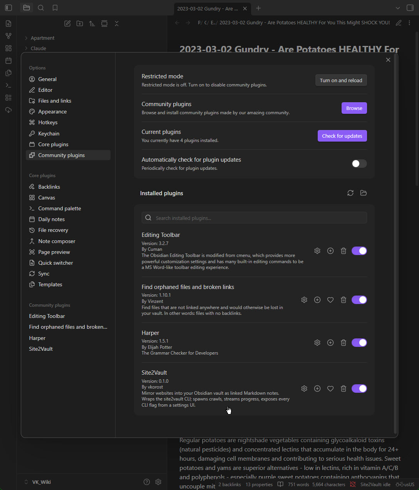
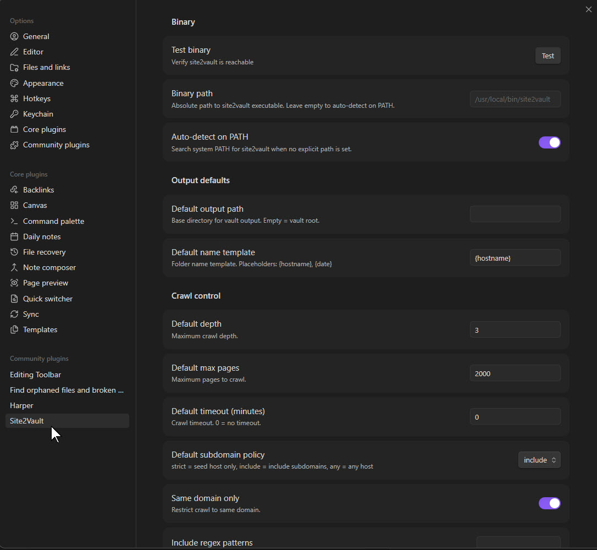
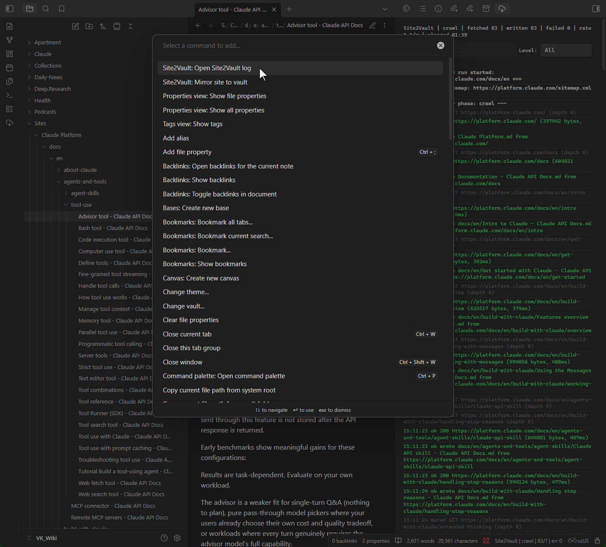
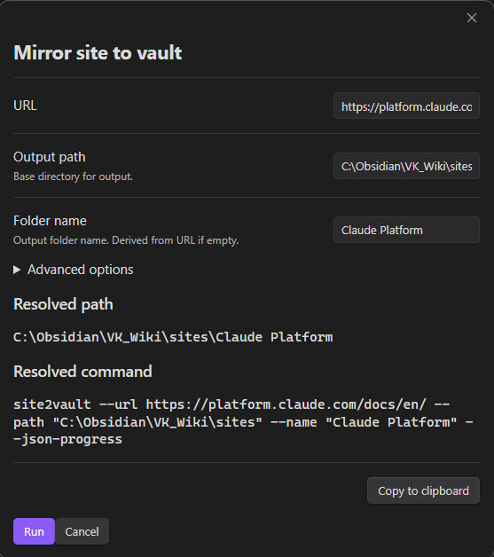
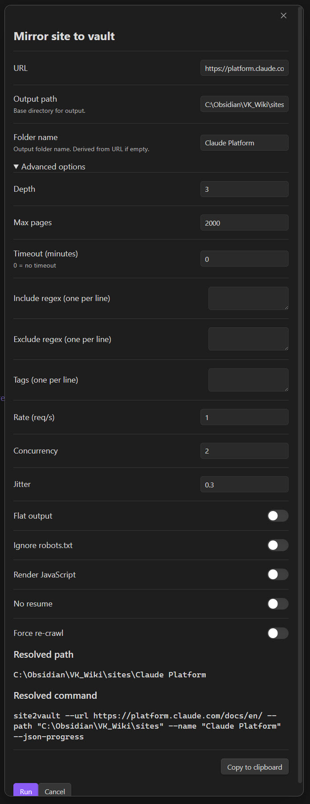
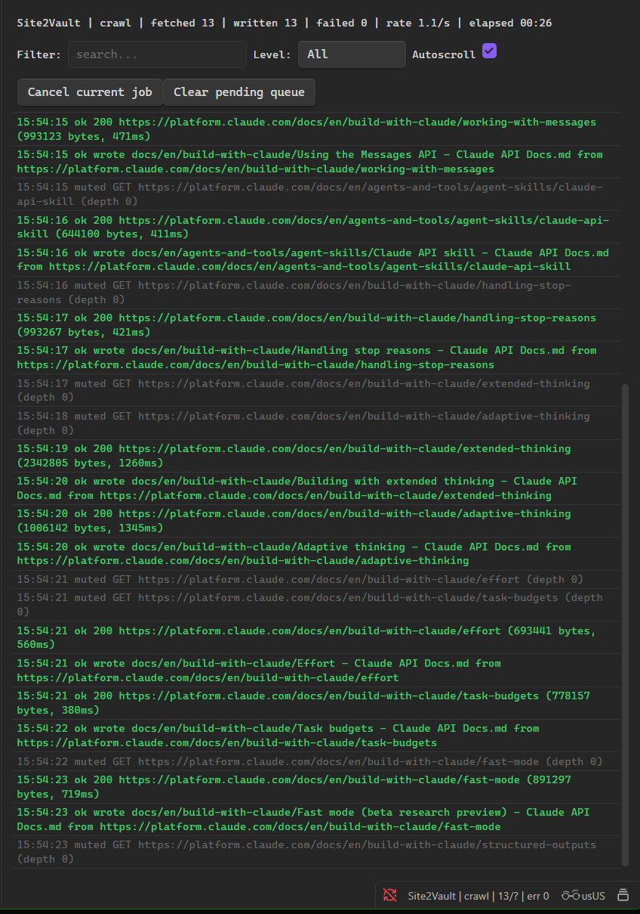
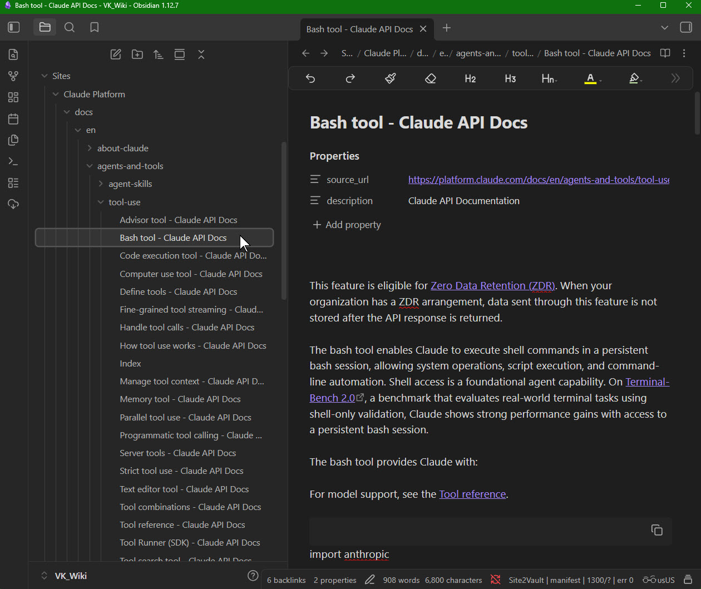

# Site2Vault User Guide

This guide walks you through installing, configuring, and using the Site2Vault Obsidian plugin to mirror websites into your vault as linked Markdown notes.

## Prerequisites

Before using the plugin, you need the **site2vault CLI** installed on your system. This is the Python binary that performs the actual crawling — the plugin is a UI wrapper around it.

Install via pipx (recommended):

```bash
pipx install site2vault
```

Or via pip:

```bash
pip install site2vault
```

Or download the standalone Windows executable from [site2vault releases](https://github.com/vkorost/site2vault).

## Step 1: Enable the Plugin

Open **Settings > Community plugins** in Obsidian. Find **Site2Vault** in the list of installed plugins and toggle it on.



You should see Site2Vault listed with its description: *"Mirror websites into your Obsidian vault as linked Markdown notes."* The status bar at the bottom of Obsidian will show **Site2Vault: idle** once the plugin is active.

## Step 2: Configure Settings

Click the gear icon next to Site2Vault in the plugin list, or navigate to **Settings > Site2Vault** in the left sidebar.



### Binary settings

- **Test binary** — click the **Test** button to verify the plugin can find the site2vault executable.
- **Binary path** — if the CLI is not on your system PATH, enter the absolute path to the executable here (e.g. `C:\user\site2vault.exe`).
- **Auto-detect on PATH** — when enabled, the plugin searches your system PATH for `site2vault`. Leave this on unless you need to specify a custom path.

### Output defaults

- **Default output path** — base directory where crawled sites will be saved. Empty means the vault root.
- **Default name template** — template for the output folder name. `{hostname}` is replaced with the site's hostname, `{date}` with the current date.

### Crawl control

These settings define the default crawl behavior. They can all be overridden per-job in the modal dialog.

- **Default depth** — how many links deep to follow (default: 3).
- **Default max pages** — maximum number of pages to crawl (default: 2000).
- **Default timeout** — crawl timeout in minutes. 0 means no timeout.
- **Default subdomain policy** — controls which subdomains are followed: `strict` (seed host only), `include` (include subdomains), or `any` (any host).
- **Same domain only** — restrict crawling to the seed URL's domain.

The settings page continues with sections for **Politeness** (rate limiting, concurrency), **Output** (flat mode, link style, boilerplate removal), **Resume & Refresh**, and **Plugin behavior** (queue size, status bar, log options).

## Step 3: Start a Crawl

Open the command palette with `Ctrl+P` (or `Cmd+P` on Mac) and type **Site2Vault** to see the available commands.



Available commands:

| Command | What it does |
|---|---|
| **Open Site2Vault log** | Opens the live log panel in the right sidebar |
| **Mirror site to vault** | Crawl an entire site and save it as Markdown notes |
| **Add single page to vault** | Capture a single URL as a Markdown note |
| **Refresh previously crawled site** | Re-crawl a site that was previously mirrored |
| **Cancel running Site2Vault job** | Stop the currently running crawl |

Select **Mirror site to vault** to open the job configuration dialog.

## Step 4: Configure the Job

The modal dialog lets you configure the crawl before starting it.



### Main fields

- **URL** — the website to crawl (e.g. `https://platform.claude.com/docs/en/`). If you omit `https://`, it will be added automatically.
- **Output path** — the base directory where the output folder will be created. This defaults to whatever you set in plugin settings.
- **Folder name** — the name of the output folder. Automatically derived from the URL hostname if left empty. You can type a custom name (e.g. "Claude Platform").

### Resolved path

At the bottom of the dialog, the **Resolved path** shows the full output directory — the combination of output path and folder name. In the example above: `C:\Obsidian\VK_Wiki\sites\Claude Platform`.

### Resolved command

The **Resolved command** shows the exact CLI command that will be executed. You can click **Copy to clipboard** to copy it for use in a terminal or for troubleshooting.

### Advanced options

Click the **Advanced options** section to expand additional settings.



Advanced options include:

- **Depth** — maximum crawl depth (default: 3)
- **Max pages** — maximum number of pages to crawl (default: 2000)
- **Timeout** — crawl timeout in minutes (0 = no limit)
- **Include regex** — only crawl URLs matching these patterns (one per line)
- **Exclude regex** — skip URLs matching these patterns (one per line)
- **Tags** — Obsidian tags to add to each note's frontmatter (one per line)
- **Rate** — requests per second (default: 1)
- **Concurrency** — number of concurrent requests (default: 2)
- **Jitter** — random delay variance in seconds (default: 0.3)
- **Flat output** — put all notes at the top level instead of preserving URL path structure
- **Ignore robots.txt** — override robots.txt restrictions
- **Render JavaScript** — use Playwright for JS-rendered pages (requires Playwright installed)
- **No resume** — start fresh instead of resuming a previous crawl
- **Force re-crawl** — ignore existing crawl state entirely

When you're ready, click **Run** to start the crawl. The dialog closes and the job begins in the background.

## Step 5: Monitor Progress

After clicking Run, the **log panel** shows live crawl progress.



### Log panel sections

**Header bar** — shows the current status at a glance: phase, pages fetched, notes written, error count, effective crawl rate, and elapsed time.

**Controls:**
- **Filter** — type to search log entries by text
- **Level** — filter by log level (All, Errors only, Writes only, No muted)
- **Autoscroll** — keeps the log scrolled to the bottom as new entries arrive. Automatically disables if you scroll up manually.

**Action buttons** (always visible, never scroll away):
- **Cancel current job** — stops the running crawl
- **Clear pending queue** — removes any queued jobs waiting to run

**Log entries** — each line shows a timestamp, log level, and message. Color-coded:
- Green entries = successful operations (pages fetched, notes written)
- Yellow = warnings
- Red = errors
- Gray = muted (routine events like GET requests)

**Status bar** — at the very bottom of Obsidian, you can also see a summary: `Site2Vault | crawl | fetched 13 | written 13 | failed 0 | rate 1.1/s`.

### Other ways to open the log

- Click the **cloud-download icon** in the left ribbon
- Run **Site2Vault: Open Site2Vault log** from the command palette
- Enable **Open log view on job start** in plugin settings to open it automatically

## Step 6: Browse the Results

Once the crawl completes, the mirrored site appears in your vault as a folder tree of linked Markdown notes. Each page from the source site becomes a note with frontmatter properties (`source_url`, `description`) and `[[wikilinks]]` connecting related pages.



The folder structure mirrors the site's URL path hierarchy. You can navigate the notes like any other Obsidian content — use backlinks, graph view, search, and all the usual Obsidian features.

## Tips

- **Queue multiple jobs**: You can start another crawl while one is running. Jobs are queued and run one at a time (FIFO).
- **Resume interrupted crawls**: If a crawl is interrupted, just run the same URL again. The plugin resumes where it left off (unless you enable "No resume").
- **Refresh a site**: Use the **Refresh previously crawled site** command to re-crawl a site and pick up new or changed pages. Enable **Prune** in advanced options to delete notes for pages that return 404.
- **On-disk logs**: By default, the plugin saves JSONL log files to `.site2vault-plugin/runs/` in your vault. You can click **Reveal log file** in the log panel footer to open the file in your system file explorer.
- **Process cleanup**: When you close Obsidian, any running crawl is automatically terminated. You don't need to manually cancel jobs before quitting.
